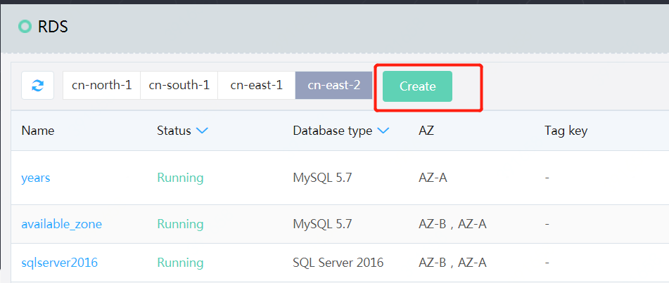
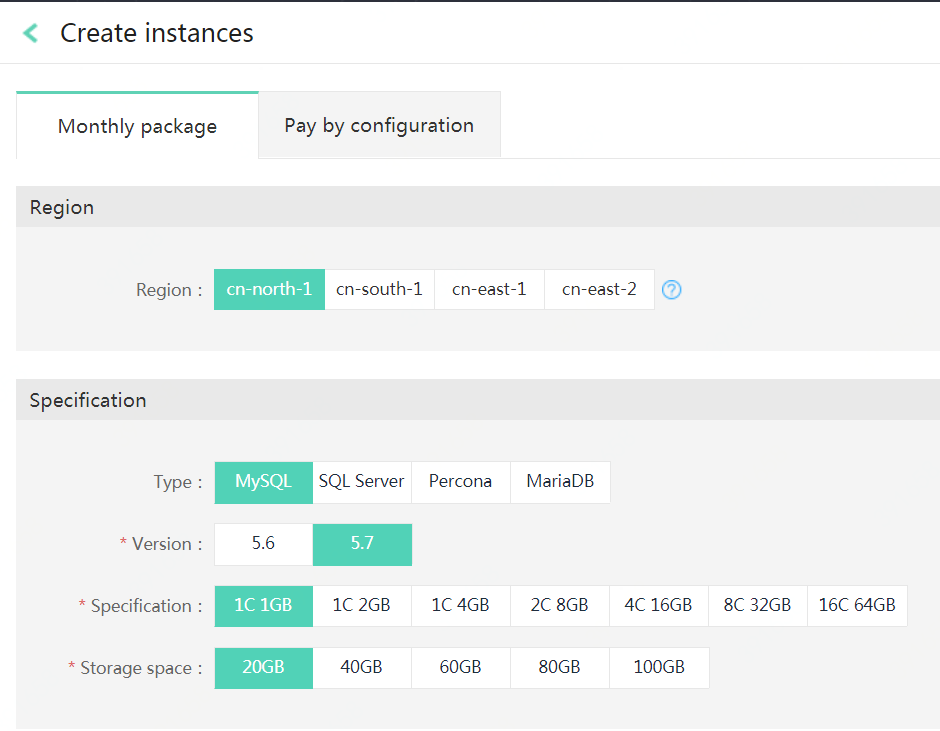
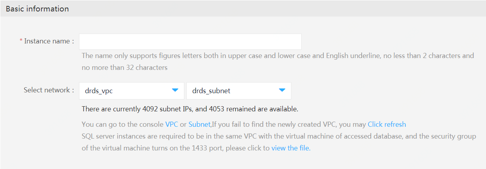
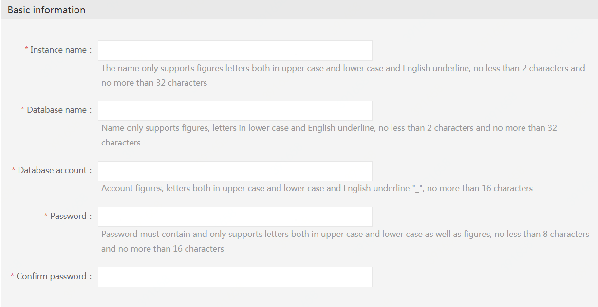
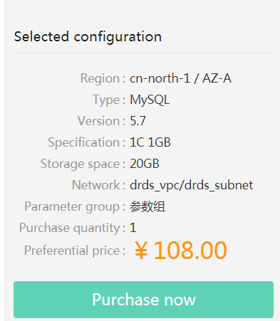
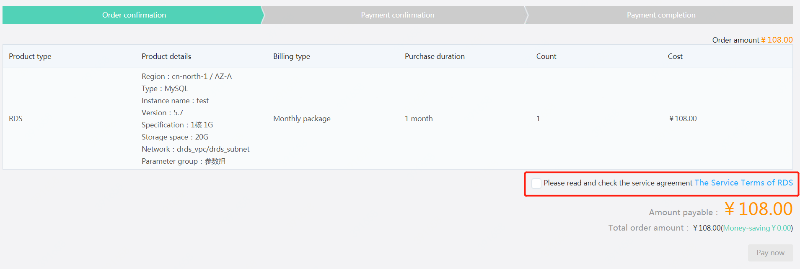
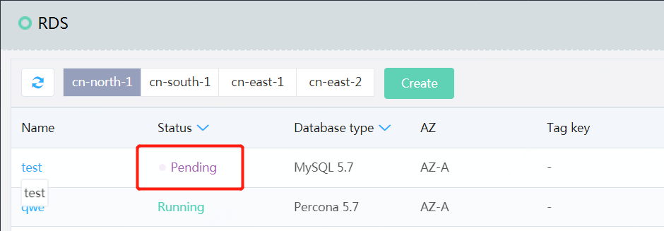

# Purchase Process 
RDS instance can be purchased through the console.

## Precondition
- Access to RDS has been opened.
- The account balance (or the Coupon amount) shall not be less than RMB 50 if the resources are paid by configuration.

## 1. Operation Entrance
- Enter [List Page of RDS Instances](https://rds-console.jdcloud.com/database) to see the summary information of RDS instance in the current region, including billing information and expiration time.
- Click***Create*** to create a new instance.

   
## 2. Select information, e.g. Instance Configuration.
Select or enter the relevant configuration information of the instance. The parameters of the instance configuration are as follows:
- Billing Method: "Monthly Package" or "Pay By Configuration" are available. Please refer to [Billing Rules](../../Billing-Rules.md) for the billing method selection.
- Region: Select the region where the instance is located. **The intranets of resources in different regions are not interconnected and cannot be changed after creation**. Please refer to the region and availability zone for details of regions.
It is recommended to choose the region closest to the regions of users to reduce access delay and increase download speed.
- Database Type: Currently, it supports three database types, namely, JCS for MySQL service, JCS for SQL Server service, JCS for Percona service, and JCS for MariaDB service and different regions support different database types, which shall be subject to the console.
- Version: It refers to the version of the database type. Different versions are supported in different regions, which shall be subject to the console.
- Type: CPU and memory of the instance in different types corresponding to relevant max. connections and max. IOPS. Please refer to the price overview for a detailed description of the types.
- Storage Space: The space includes data space, system file space, and log file space.

- Virtual Private Cloud: Instances can only be created in the Virtual Private Cloud. If not having a Virtual Private Cloud and subnet, users can create a Virtual Private Cloud and subnet through the link of ***New Virtual Private Cloud*** and ***Create New Subnet***. After the creation is complete, click ***Refresh*** to see the newly created Virtual Private Cloud and subnet.
   - Please make sure that database instance and VM that needs to connect to the database instance are in the same Virtual Private Cloud when choosing Virtual Private Cloud.
   - Instance can be created in a selected subnet which retains a vast number of remaining IPs to allow creation of instances due to management demand.
      - JCS for MySQL, JCS for Percona, and JCS for MariaDB: More than 4 remaining IPs are required.
      - JCS for SQL Server: More than 10 remaining IPs are required.
      

 
- Deployment Mode: Currently, it supports single-availability zone deployment and multi-availability zone deployment.
   - Multiple Availability Zones: The primary and secondary databases are located in different availability zones, with higher availability; if an availability zone fails, the entire instances can still provide services.
   - Single Availability Zone Deployment: The primary and secondary database are located in the same availability zone. If the availability zone fails, the entire instances cannot provide services.
   
  

- Basic Information
   - Instance Name: It is allowed to repeat, while the length and characters of the name have certain limits, which shall be subject to the console.
   - Database Name: When the instance is created successfully, the corresponding database specified will be created in the instance, and the name refers to the given database name. Please refer to Q&A for the keywords of database name we have reserved, and the length and characters of the database name are limited, which shall be subject to the console.
   - Database Account and Password: After the instance is created successfully, you can use the account and password to login the database instance. Please refer to Q&A for the keywords of database name we have reserved, and the length and characters of the database name can be limited, which shall be subject to the console.

- Purchase Duration: The purchase duration shall be selected if the billing method is monthly package, with options varying from 1 month to 2 years. The longer the purchase duration, the greater the discount is, which shall be subject to the console.

## 3. Purchase Confirmation
After the information is input, the price information will be displayed at the right side of the page and click ***Buy Now***.

## 4. Payment Order
Then enter the order confirmation page, and click ***Pay Now*** after confirming the purchase information is correct.

## 5. Instance Pending
- The page will return to the instance list page automatically after successful payment, and users can see the instance status as "pending".
- Then enter the order confirmation page, and click ***Pay Now*** after confirming the purchase information is correct.

## 6. Creation Completed
After a while, click the refresh button to manually refresh the page, the page will display that the instance is created in normal running condition.

