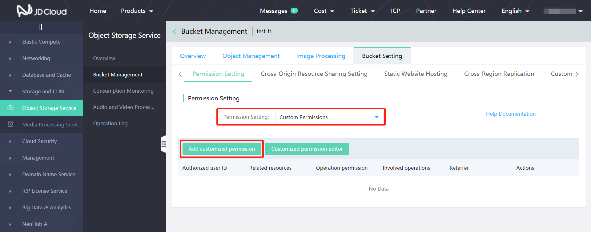
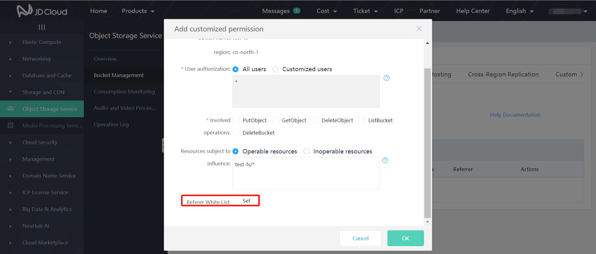
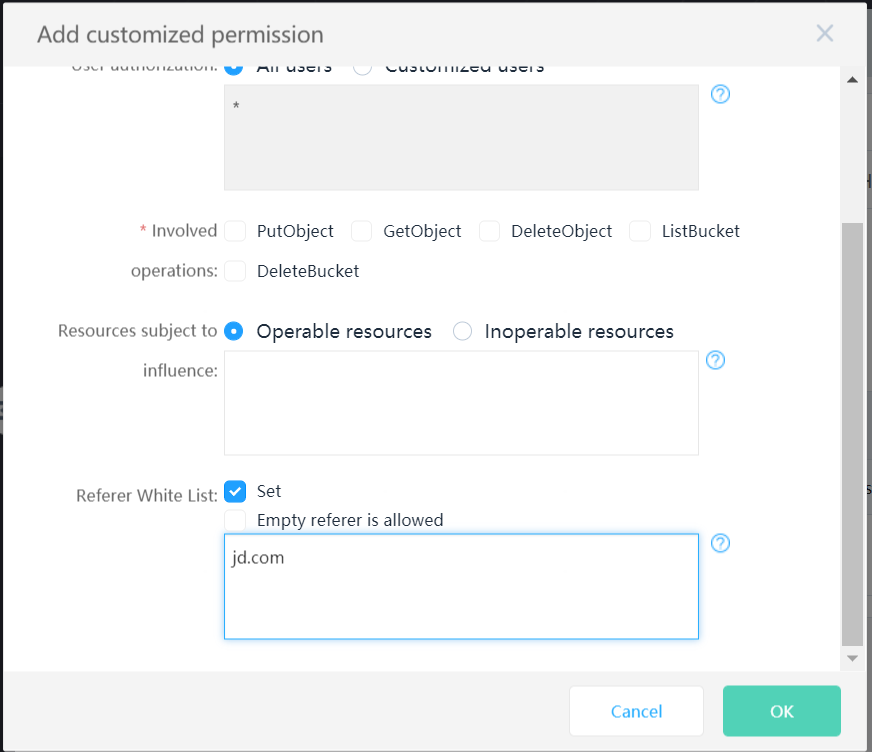
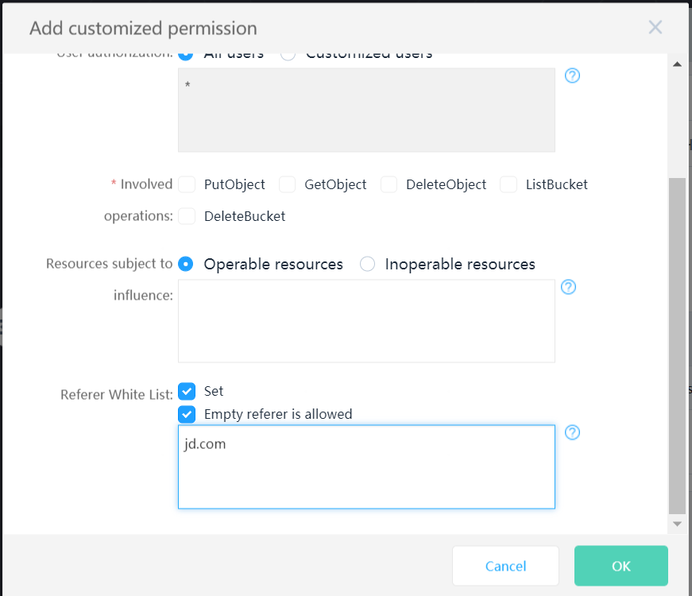

# Best Practices of Anti-Leech

To prevent the data stored in Object Storage Service from hotlinking by others, Object Storage Service supports anti-leech chain method based on HTTP Header Referer field. You can set the White List of Referer field through the console. After setting the White List, only users of Referer field within the White List can access the data stored in Bucket and those requests out of the White List will be denied. However, if the Referer White List is not configured, data can be accessed by default without being limited by the White List.

## Anti-Leech

Website A stores its static resources such as images or videos on the OSS of JD Cloud storage. But website B uses these images or videos resources of website A to put on its own website without permit of website A. In this way, website B steals the space and traffic of website A while A did not receive any benefit but bear fees for using these resources. The behavior that B steals A's resources to put on its own website is called hotlinking.

The primary method for anti-leech is to limit referrers by setting Referer:

The principle for setting Referer is to compare the Referer attribute of HTTP request header (has saved which URL sends this request to the server) with the White List permitted by the server, if consistency, it indicates it is an intra-request or a site request that you can trust; if inconsistency, it is considered to be hotlinking and the request of this site will be denied.

## Referer

Referer is a parameter of HTTP request header. The Referer attribute of HTTP request header will be different in different scenarios:

Directly access server resources: namely the browser directly request for OSS resources, that means the HTTP request excludes Referer attribute

Quote OSS resources in a network A: The browser visits the page of the network http://jd.com/ and the page quotes the resources of OSS. When the browser requests resources from OSS, the request header of HTTP contains the Referer attribute and the attribute indicates that the http://jd.com/ page quotes the resource.

## Configure Anti-Leech

Log in the Object Storage Service page and enter the Setting-Permission Setting page under one Bucket, as shown in the figure below:

Once the write-read permission of this Bucket is set as the customized permission, click to add the customized permission, as shown in the figure below:

Check Referer White List in the "Setting" to set the Referer White List and set if the Referer is allowed to be blank.

For more details about configuration action of Referer, please visit the access permission setting.

Results of different settings are listed as below:

If the origin server is http://jd.com/, the hotlinking is http://jd-steal.com/

1. Set Referer White List and allow referer to be blank to realize the Anti-leech function

The access results are as follows:

|Access Type|Description|Result|
|-|-|-|
|http://test-refer.oss.cn-east-1.jcloudcs.com/example.jpg |Direct access, blank Referer|Blank Referer request not allowed, return 403|
|http://jd.com/|Request from Origin Server|Successful Access|
|http://jd-steal.com/ |Request from Anti-leech Website|Return 403|

2. Set Referer White List and allow referer to be blank to realize the Anti-Leech function

The access results are as follows:

|Access Type|Description|Result|
|-|-|-|
|http://test-refer.oss.cn-east-1.jcloudcs.com/example.jpg |direct access, blank Referer|Allow blank Referer request, successful access|
|http://jd.com/ |Request from Origin Server|Successful Access|
|http://jd-steal.com/ |Request from Anti-leech Website|Return 403|
3. Set the Referer White List to be blank. If the HTTP request contains the Referer, OSS will refuse requests from all website, including the trusted website. Thus, the configuration is not recommended for use. If you want to realize the anti-leech, please adopt the first two configuration schemes.
