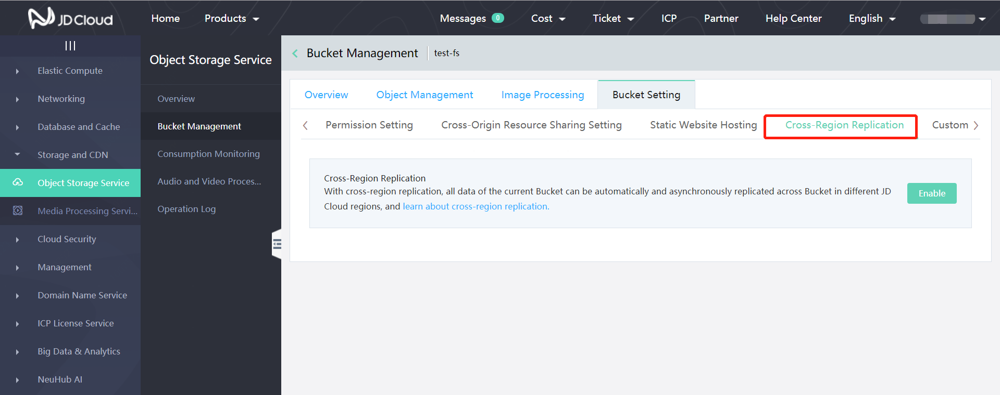
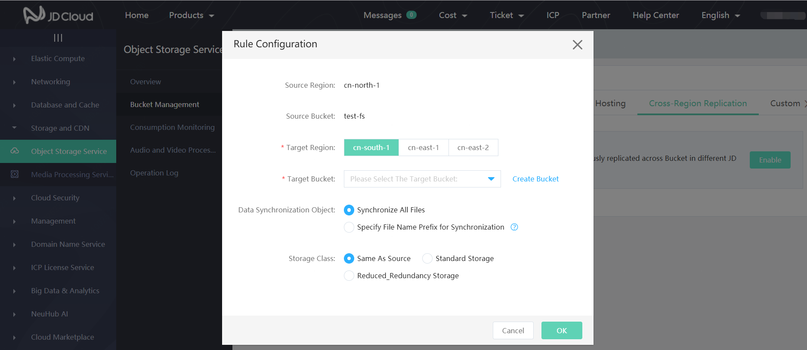

# Cross-region Replication Setting

Bucket Cross-Region Replication is a cross-region Bucket automatic and asynchronous replication of Object, which synchronizes changes (excluding deletion actions) to objects in the source Bucket to the target Bucket. The Bucket cross-region replication function can well meet the requirements of user data replication or provide the demands for Bucket cross-region disaster tolerance. The objects in the target Bucket are exact backup copies of the objects in the source Bucket, which have the same object names, metadata and contents.

## Customer Scenario

Setting up cross-region replication may be helpful when you have the following needs: 

* Data replication: For business reasons, data need to be migrated from one storage area to another, and the original spatial data will remain.

* Compliance requirement: A backup copy of data required by compliance requirement needs to be saved across a certain distance. Through cross-region synchronization management function, data can be synchronized between remote storage areas to meet these compliance requirements.

* Data backup and disaster tolerance: If you want to save or maintain a backup copy of all written data in the long-distance storage area, in case of damage caused to the storage area by catastrophes such as tsunamis or earthquakes, you can enable backup data of the long-distance off-site storage area.

* Minimize latency: Customers are in two geographic locations. To minimize the latency in accessing objects, a backup copy of the object can be maintained in a storage area that is geographically closer to the user.

## The setup process in the console is as follows:

1. Login to the Console->OSS->Object Storage Service->Enter a Bucket->Space Settings->Cross-Region Replication

2. Click the Enable button to open the dialog box of cross-region replication rules configuration.

3. Select the region the target Bucket is located and the Bucket name.

Detail Specification:

* The two Buckets for data synchronization must belong to two regions; data synchronization cannot be performed between Buckets in the same region.

* The two Buckets that enable cross-region synchronization cannot be synchronized with any other Bucket at the same time.

4. Select Synchronization Objects

* Synchronize all files: Synchronize all files in the source Bucket to the target Bucket.

* Assign file name prefixes for synchronization: Synchronize files with the assigned prefixes in the source Bucket to the target Bucket.

   a. You can add at most 1000 prefixes. Each prefix can be at most 1024 bytes.

   b. File prefixes do not support overlapping prefixes, for example, text and test/01 are not allowed.

5. Select Storage Type

 * Same as source: The storage type will be consistent with that of the file in the source storage, which is the default setting if you do not assign it.

 * Standard storage: Set the replicated file storage type as standard storage.

 * Low redundancy storage: Set the replicated file storage type as low redundancy storage.

6. Click the Confirm button to save the settings.

Detail Specification:

 * After the rules configuration is done, the Bucket synchronization task will be automatically and asynchronously performed. The time it takes for data to be replicated to the target Bucket depends on the data size, usually ranging from a few seconds to a few hours.

 * Since the source Bucket that enables cross-region replication and the target Bucket can both operate independently, if the new file in the source Bucket has the same name as the file in the target Bucket, the file with the same name in the target Bucket will be replaced. Please operate carefully.

 * If there is a region replication rule, neither the source Bucket nor the target Bucket can be deleted. The cross-region replication must be disabled first.

 * The condition for enabling cross-region synchronization is that the synchronization configuration with other Buckets of the two Buckets that are synchronized is not enabled, and the two Buckets cannot be synchronized by other Buckets. For example, if Bucket A is enabled for synchronization to Bucket B, then you can no longer enable synchronization to Bucket C for Bucket A unless you change the synchronization configuration of Bucket A to Bucket B to Bucket C. Similarly, if Bucket A is enabled for the synchronization to Bucket B, then it is not allowed to enable the synchronization of Bucket C to Bucket B at this time.

* Cross-region replication does not support historical data synchronization for now.
